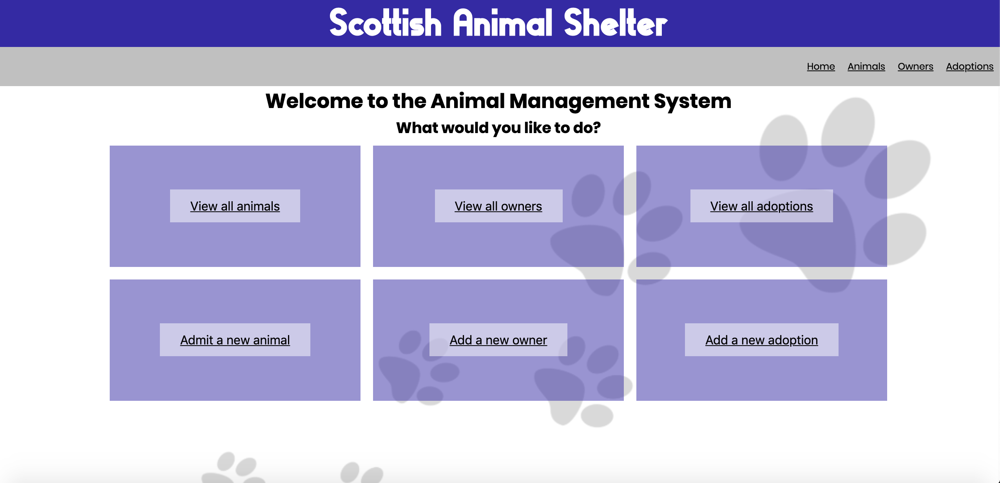

# Solo Ruby Project
#### Management System for an Animal Shelter.

Solo project for CodeClan, this project was built over a period of 5 days in weeks 4 & 5 of the course.

A full stack app using a Ruby/Sinatra with PostgreSQL backend and an HTML and CSS frontend.

## Brief

*The Scottish Animal Shelter accepts orphaned or stray animals and takes care of them until they can be adopted by a new owner. The shelter has a list of potential new owners for the animals. Animals may take a while to be trained up and made healthy before being available for adoption.

They are looking for a management system to keep track of their animals and owners.*
