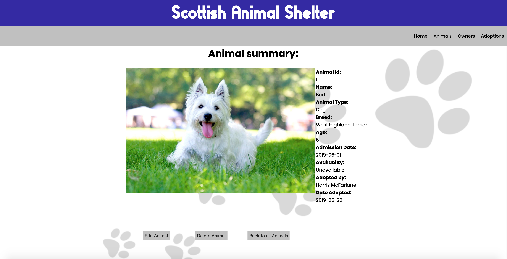
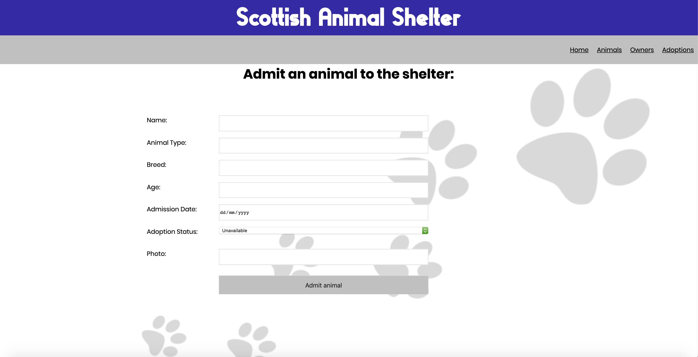
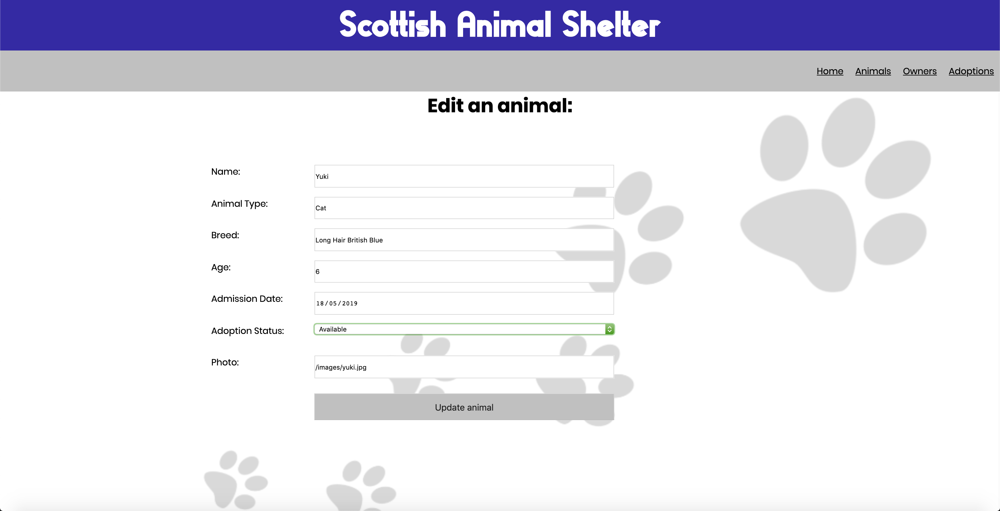
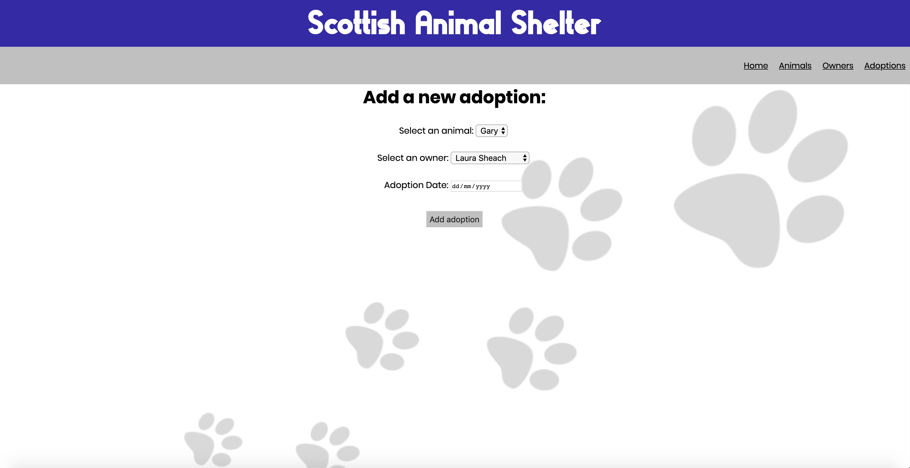
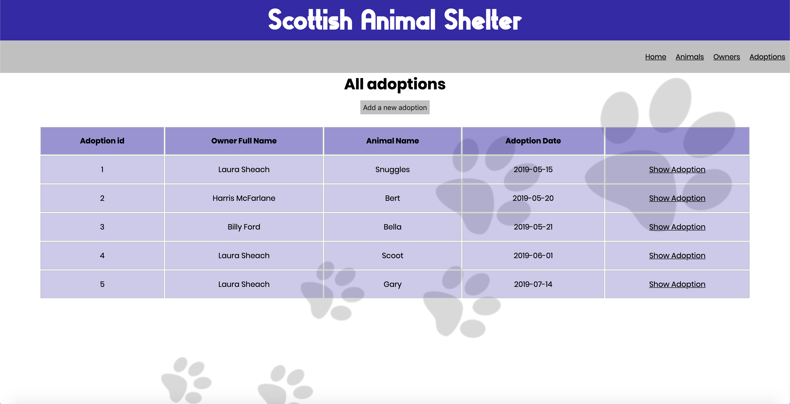
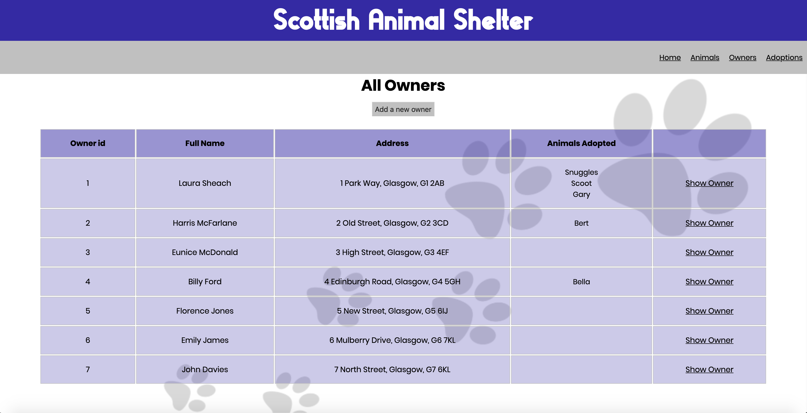
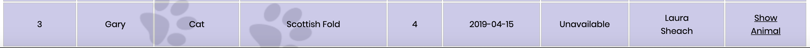
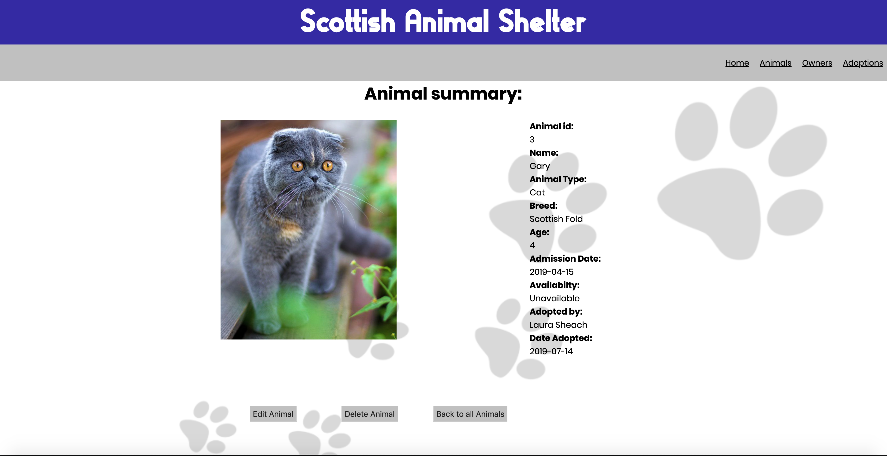
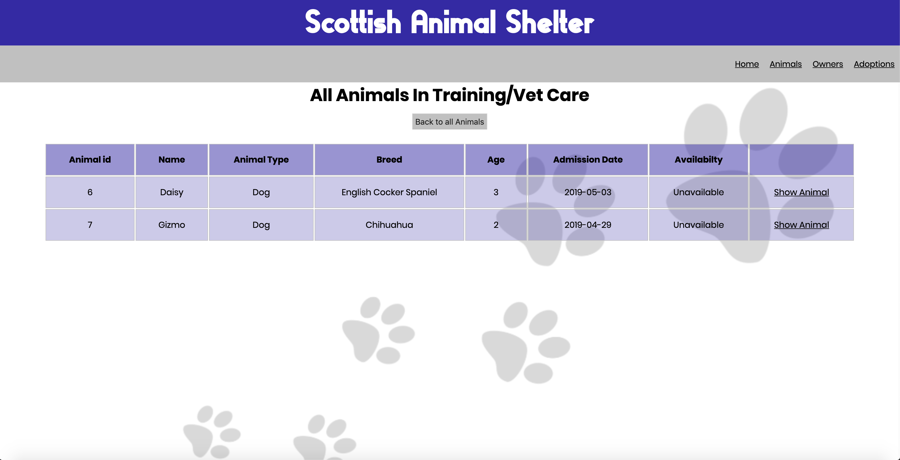
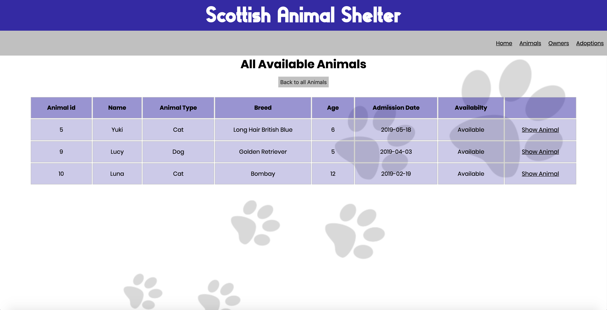

# Solo Ruby Project
#### Management System for an Animal Shelter.

Solo project for CodeClan, this project was built over a period of 5 days in weeks 4 & 5 of the course.

A full stack app using a Ruby/Sinatra with PostgreSQL backend and an HTML and CSS frontend.


## Brief

The Scottish Animal Shelter accepts orphaned or stray animals and takes care of them until they can be adopted by a new owner. The shelter has a list of potential new owners for the animals. Animals may take a while to be trained up and made healthy before being available for adoption.

They are looking for a management system to keep track of their animals and owners.

## Features

The Shelter Manager is able to undertake the following tasks:

* View all animals and their admission dates

* Admit a new animal into the system

* Can update the adoption status of an animal

* Mark an animal as unavailable automatically on adoption

* Assign an animal to an owner

* View a list of all the owners and their adopted animals

* View a list of animals still in training/vet care on a separate page

* View a list of all animals available for adoption on a separate page

* Full CRUD functionality

## Screenshots

#### View All Animals


#### Animal Summary


#### Admit A New Animal


#### Edit/Update An Animal


#### New Adoption


#### All Adoptions


#### All Owners & Potential Owners


#### Animal Marked as Unavailable on Adoption (Gary)


#### Animal Marked Unavailable & Adoption Added to Summary


#### Animals in Training/Vet Care


#### Animals Available for Adoption


## Installation

```
createdb animal_shelter

psql -d animal_shelter -f db/animal_shelter.sql

ruby db/seeds.rb

ruby app.rb
```

Visit http://localhost:4567 in your browser
